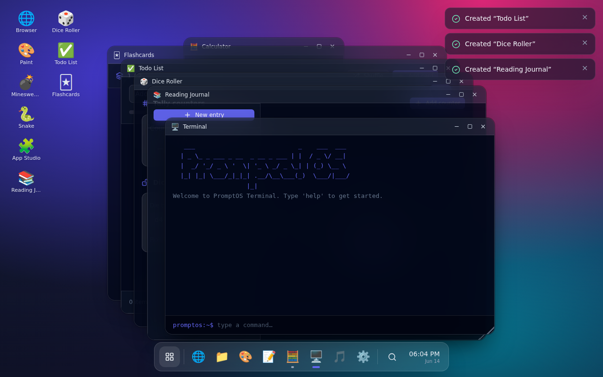

# PromptOS

A browser-based experimental **operating system interface** that builds apps on demand.
Search for an app in the OS launcher — if it already exists it opens; if it doesn't,
PromptOS **generates a working version** from a safe template and saves it to your app
library.

> 100% client-side. No backend, no authentication, no cloud storage, no paid APIs.
> Everything runs in the browser and persists to `localStorage`.



## Quick start

```bash
npm install
npm run dev      # http://localhost:5173
```

Build for production:

```bash
npm run build    # type-checks then bundles to dist/
npm run preview  # serve the production build
```

## How it works

- **Desktop & window manager** — a full-screen glassmorphism desktop with a dock,
  Spotlight-style search launcher (`⌘/Ctrl + K`), system clock, toast notifications,
  and draggable / resizable / minimizable / maximizable windows. Multiple apps run at
  once, each lazily code-split.
- **Universal search** — type anything in the launcher. It resolves to a built-in app,
  one of your previously generated apps, or offers **“Create app: …”** when nothing
  matches.
- **Safe app generation** — user text is **never** turned into executable code. Search
  terms are matched against a registry of rules (`src/os/appGenerator.ts`) that pick a
  trusted template type and field configuration. The result is JSON metadata rendered by
  a trusted React template (`src/apps/templates/*`). The generator interface is
  swappable, so a local/remote AI model could back `previewGeneration` later without
  changing callers.

A generated app is just data:

```ts
{
  id: string,
  name: string,
  description: string,
  icon: string,        // emoji
  templateType: 'tracker' | 'collection' | 'writing' | 'study'
              | 'checklist' | 'timer' | 'counter' | 'dashboard' | 'form',
  createdAt: string,
  config: { fields?: TemplateField[] },
  data: object,        // your rows / cards / entries / ...
}
```

## Built-in apps

| App | What it does |
| --- | --- |
| 🌐 Browser | Sandboxed simulated browser — tabs, history, bookmarks, simulated pages & search (opens real results in a new tab) |
| 🎨 Paint | Canvas drawing — brush, eraser, color picker, sizes, clear, save & PNG export |
| 💣 Minesweeper | Classic game — difficulties, flags, flood-fill, timer, first-click-safe |
| 🐍 Snake | Keyboard-controlled, scoring, increasing speed, high score |
| 🧮 Calculator | Arithmetic with keyboard support, backspace, sign, percent |
| 📝 Notes | Create / edit / delete notes, searchable, persisted |
| 📁 Files | Virtual file manager — folders, text files, generated apps, notes |
| 🎵 Media Player | Music-player shell — playlist, transport, visualizer (demo, no audio files) |
| ⚙️ Settings | Wallpaper, light/dark theme, accent color, reduce motion, clear all data |
| 🖥️ Terminal | `help`, `apps`, `open <app>`, `create <app>`, `theme dark\|light`, `clear`, `about`, `echo`, `date` |
| 🧩 App Studio | Manage generated apps — rename, edit description/icon, change template, delete |

## Generated app templates

`tracker` (configurable table with totals), `collection` (card database),
`writing` (journal), `study` (flip-card flashcards), `checklist` (todo),
`timer` (countdown + stopwatch), `counter` (tallies + dice roller),
`dashboard` (live widgets), `form` (form + submissions).

Try searching: `budget tracker`, `recipe book`, `flashcards`, `journal`, `habit tracker`,
`timer`, `dice roller`, `grocery list`, `feedback form`, `dashboard`.

## Tech stack

React 18 · TypeScript (strict) · Vite · Tailwind CSS · Zustand · lucide-react ·
`localStorage` persistence.

## Project structure

```
src/
  main.tsx, App.tsx
  os/              desktop, window manager, store, registry, generator, storage, types
  apps/            built-in apps + GeneratedAppRenderer
  apps/templates/  the 9 generated-app template renderers
  components/      Button, Modal, Icon
  styles/          globals.css (Tailwind + glass utilities)
```

## Notes

- All data lives in your browser under the `promptos:` localStorage namespace.
  Settings → **Clear all data** wipes it.
- There is an intentional placeholder seam for future AI integration in
  `appGenerator.ts` — no external AI API is called.
